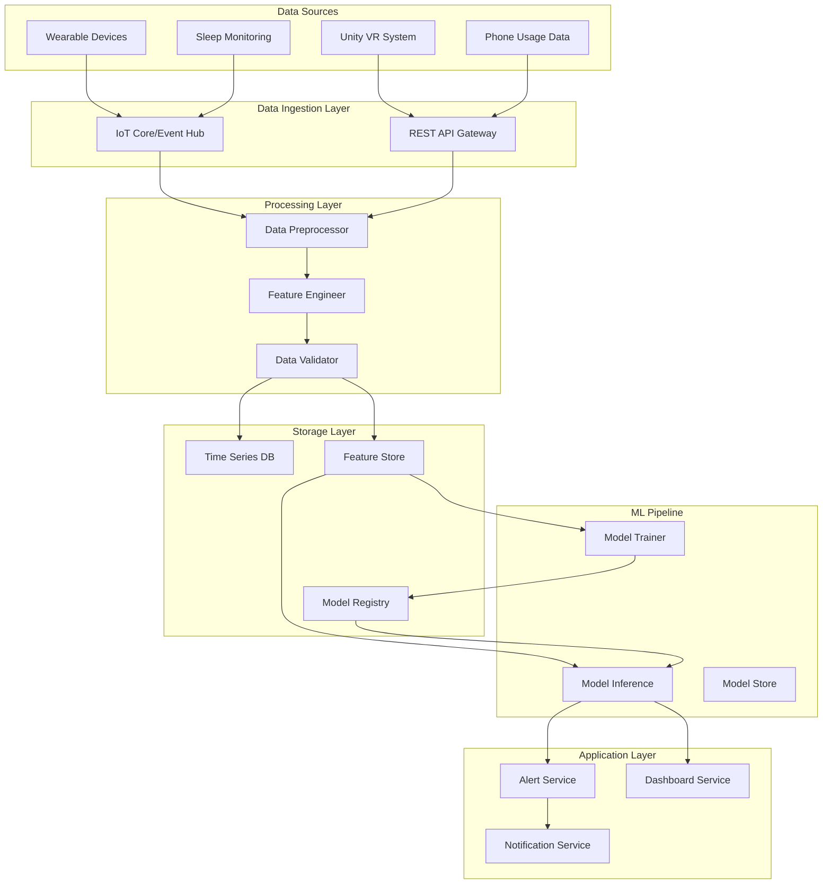

# Design Document

## Overview

The Good Doctor ML system is a comprehensive stress monitoring and panic attack prediction platform designed specifically for autistic children. The system processes multi-modal data from wearable devices, Unity VR sessions, and behavioral patterns to provide real-time stress classification, continuous stress intensity monitoring, next-day forecasting, and panic attack probability predictions.

The architecture follows a microservices approach with separate components for data ingestion, preprocessing, model training, inference, and alerting. The system is designed to handle both batch processing for model training and real-time streaming for continuous monitoring.

## Architecture

### High-Level System Architecture



### Technology Stack

**Cloud Infrastructure:**
- AWS: SageMaker (training/inference), IoT Core (data ingestion), S3 (storage), DynamoDB (metadata)
- Alternative: Azure ML, Google Cloud AI Platform

**Data Processing:**
- Apache Kafka/AWS Kinesis for streaming data
- Apache Spark for batch processing
- Redis for real-time feature caching

**Machine Learning:**
- Python with scikit-learn, XGBoost, PyTorch/TensorFlow
- MLflow for experiment tracking
- SHAP for model explainability

**APIs and Services:**
- FastAPI for REST endpoints
- WebSocket for real-time updates
- Docker containers with Kubernetes orchestration

## Components and Interfaces

### 1. Data Ingestion Service

**Purpose:** Collect and route data from multiple sources to processing pipeline

**Interfaces:**
- IoT MQTT endpoint for wearable device data
- REST API for Unity VR and phone usage data
- Webhook endpoints for third-party integrations

**Key Functions:**
```python
class DataIngestionService:
    def ingest_physiological_data(self, device_id: str, timestamp: datetime, 
                                skin_conductance: float, accelerometer: dict) -> bool
    
    def ingest_behavioral_data(self, participant_id: str, phone_usage: dict, 
                             mobility_data: dict) -> bool
    
    def ingest_sleep_data(self, participant_id: str, sleep_metrics: dict) -> bool
    
    def validate_data_quality(self, data: dict) -> ValidationResult
```

### 2. Data Preprocessing Service

**Purpose:** Clean, validate, and transform raw data into ML-ready features

**Key Functions:**
```python
class DataPreprocessor:
    def handle_missing_values(self, df: pd.DataFrame) -> pd.DataFrame
    def normalize_features(self, df: pd.DataFrame) -> pd.DataFrame
    def create_time_windows(self, df: pd.DataFrame, window_size: int) -> pd.DataFrame
    def validate_data_ranges(self, df: pd.DataFrame) -> ValidationReport
```

**Data Transformations:**
- Remove non-predictive columns (participant_id, day, raw timestamps)
- Impute missing values using median for numerical, mode for categorical
- Apply z-score normalization to all numerical features
- Create sliding time windows for temporal analysis

### 3. Feature Engineering Service

**Purpose:** Create derived features that enhance predictive power

**Derived Features:**
```python
class FeatureEngineer:
    def calculate_sleep_efficiency(self, sleep_duration: float, psqi_score: float) -> float:
        return sleep_duration / (24 - psqi_score)
    
    def calculate_social_load(self, num_calls: int, num_sms: int, call_duration: float) -> float:
        return num_calls + num_sms + (call_duration / 60)
    
    def calculate_mobility_index(self, mobility_distance: float, mobility_radius: float) -> float:
        return mobility_distance / max(mobility_radius, 0.1)  # Avoid division by zero
    
    def create_temporal_features(self, df: pd.DataFrame) -> pd.DataFrame:
        # Rolling averages, trends, and change rates
        pass
```

### 4. Model Training Service

**Purpose:** Train and evaluate multiple ML models for different prediction tasks

**Model Architecture:**

```python
class ModelTrainer:
    def __init__(self):
        self.models = {
            'stress_classifier': {
                'random_forest': RandomForestClassifier(),
                'xgboost': XGBClassifier(),
                'neural_net': MLPClassifier()
            },
            'stress_regressor': {
                'random_forest': RandomForestRegressor(),
                'xgboost': XGBRegressor(),
                'neural_net': MLPRegressor()
            },
            'time_series': {
                'lstm': LSTMModel(),
                'transformer': TransformerModel()
            }
        }
    
    def train_stress_classifier(self, X_train: np.ndarray, y_train: np.ndarray) -> ModelResults
    def train_stress_regressor(self, X_train: np.ndarray, y_train: np.ndarray) -> ModelResults
    def train_forecasting_model(self, sequences: np.ndarray, targets: np.ndarray) -> ModelResults
    def evaluate_models(self, X_test: np.ndarray, y_test: np.ndarray) -> EvaluationReport
```

### 5. Model Inference Service

**Purpose:** Provide real-time predictions using trained models

**Prediction Endpoints:**
```python
class ModelInferenceService:
    def predict_stress_level(self, features: dict) -> StressClassification
    def predict_stress_intensity(self, features: dict) -> StressIntensity
    def predict_next_day_stress(self, historical_features: list) -> ForecastResult
    def predict_panic_probability(self, time_series_data: np.ndarray) -> PanicProbability
    def get_feature_importance(self, prediction_type: str) -> FeatureImportance
```

### 6. Alert and Notification Service

**Purpose:** Monitor predictions and trigger alerts based on configurable thresholds

```python
class AlertService:
    def __init__(self):
        self.thresholds = {
            'high_stress': 27,  # PSS score
            'panic_probability': 0.7,
            'alert_fatigue_limit': 10  # per day
        }
    
    def evaluate_stress_alert(self, stress_level: float, participant_id: str) -> AlertDecision
    def evaluate_panic_alert(self, panic_prob: float, participant_id: str) -> AlertDecision
    def send_notification(self, alert: Alert, recipients: list) -> NotificationResult
    def manage_alert_fatigue(self, participant_id: str) -> ThresholdAdjustment
```

## Data Models

### Core Data Structures

```python
@dataclass
class PhysiologicalData:
    participant_id: str
    timestamp: datetime
    skin_conductance: float  # µS
    accelerometer_x: float   # g-force
    accelerometer_y: float
    accelerometer_z: float
    heart_rate: Optional[float] = None

@dataclass
class BehavioralData:
    participant_id: str
    day: int
    call_duration: float     # minutes
    num_calls: int
    num_sms: int
    screen_on_time: float    # hours
    mobility_radius: float   # km
    mobility_distance: float # km

@dataclass
class SleepData:
    participant_id: str
    date: date
    sleep_time: datetime
    wake_time: datetime
    sleep_duration: float    # hours
    psqi_score: int         # 0-21

@dataclass
class PersonalityProfile:
    participant_id: str
    openness: float
    conscientiousness: float
    extraversion: float
    agreeableness: float
    neuroticism: float

@dataclass
class StressAssessment:
    participant_id: str
    timestamp: datetime
    pss_score: int          # 0-40
    stress_level: str       # Low/Moderate/High
    confidence: float       # 0-1
```

### Feature Schema

```python
class FeatureSchema:
    PHYSIOLOGICAL_FEATURES = [
        'skin_conductance', 'accelerometer_magnitude', 
        'heart_rate_variability'
    ]
    
    BEHAVIORAL_FEATURES = [
        'sleep_efficiency', 'social_load_index', 'mobility_index',
        'screen_time_normalized', 'activity_level'
    ]
    
    TEMPORAL_FEATURES = [
        'stress_trend_7d', 'sleep_quality_trend', 'mobility_change_rate',
        'social_activity_change'
    ]
    
    PERSONALITY_FEATURES = [
        'openness', 'conscientiousness', 'extraversion', 
        'agreeableness', 'neuroticism'
    ]
```

## Error Handling

### Data Quality Issues

```python
class DataQualityHandler:
    def handle_missing_sensors(self, data: dict) -> dict:
        """Handle cases where sensor data is temporarily unavailable"""
        if 'skin_conductance' not in data:
            # Use last known value with decay factor
            data['skin_conductance'] = self.get_last_known_value('skin_conductance') * 0.9
        return data
    
    def handle_outliers(self, feature_values: np.ndarray) -> np.ndarray:
        """Detect and handle statistical outliers"""
        q1, q3 = np.percentile(feature_values, [25, 75])
        iqr = q3 - q1
        lower_bound = q1 - 1.5 * iqr
        upper_bound = q3 + 1.5 * iqr
        return np.clip(feature_values, lower_bound, upper_bound)
    
    def validate_temporal_consistency(self, time_series: pd.DataFrame) -> ValidationResult:
        """Ensure temporal data makes logical sense"""
        # Check for impossible time jumps, negative durations, etc.
        pass
```

### Model Prediction Errors

```python
class PredictionErrorHandler:
    def handle_model_failure(self, model_type: str, fallback_strategy: str) -> PredictionResult:
        """Handle cases where primary model fails"""
        if fallback_strategy == 'ensemble_average':
            return self.get_ensemble_prediction(model_type)
        elif fallback_strategy == 'last_known_baseline':
            return self.get_baseline_prediction(model_type)
    
    def handle_confidence_threshold(self, prediction: float, confidence: float) -> PredictionResult:
        """Handle low-confidence predictions"""
        if confidence < 0.6:
            return PredictionResult(
                value=prediction,
                confidence=confidence,
                warning="Low confidence prediction - consider manual review"
            )
```

### Alert System Reliability

```python
class AlertReliabilityHandler:
    def handle_notification_failure(self, alert: Alert, primary_channel: str) -> bool:
        """Implement fallback notification channels"""
        backup_channels = ['email', 'sms', 'push_notification']
        for channel in backup_channels:
            if channel != primary_channel:
                if self.send_via_channel(alert, channel):
                    return True
        return False
    
    def handle_alert_fatigue(self, participant_id: str, alert_count: int) -> AlertStrategy:
        """Adjust alert sensitivity to prevent fatigue"""
        if alert_count > 10:
            return AlertStrategy(
                threshold_multiplier=1.2,
                summary_mode=True,
                frequency_limit="hourly"
            )
```

## Testing Strategy

### Unit Testing

```python
class TestDataPreprocessor:
    def test_missing_value_imputation(self):
        """Test that missing values are properly imputed"""
        pass
    
    def test_feature_normalization(self):
        """Test z-score normalization produces correct distributions"""
        pass
    
    def test_derived_feature_calculation(self):
        """Test that derived features are calculated correctly"""
        pass

class TestModelTraining:
    def test_model_convergence(self):
        """Test that models converge within expected iterations"""
        pass
    
    def test_cross_validation_stability(self):
        """Test that CV scores are stable across folds"""
        pass
    
    def test_feature_importance_consistency(self):
        """Test that feature importance rankings are consistent"""
        pass
```

### Integration Testing

```python
class TestEndToEndPipeline:
    def test_data_flow_integrity(self):
        """Test complete data flow from ingestion to prediction"""
        pass
    
    def test_real_time_latency(self):
        """Test that real-time predictions meet latency requirements"""
        pass
    
    def test_alert_system_reliability(self):
        """Test alert triggering and notification delivery"""
        pass
```

### Performance Testing

```python
class TestPerformanceMetrics:
    def test_prediction_accuracy_benchmarks(self):
        """Verify models meet accuracy requirements"""
        # Stress classification: ≥85% accuracy
        # Stress regression: RMSE ≤3.0, R² ≥0.75
        # Next-day forecasting: MAE ≤2.5
        # Panic prediction: PR-AUC ≥0.80
        pass
    
    def test_throughput_requirements(self):
        """Test system can handle expected data volumes"""
        pass
    
    def test_scalability_limits(self):
        """Test system behavior under increasing load"""
        pass
```

### Clinical Validation Testing

```python
class TestClinicalValidation:
    def test_feature_clinical_relevance(self):
        """Validate that top features align with clinical knowledge"""
        expected_top_features = [
            'skin_conductance', 'sleep_duration', 'psqi_score', 
            'screen_on_time', 'mobility_index'
        ]
        pass
    
    def test_prediction_interpretability(self):
        """Test that SHAP explanations are clinically meaningful"""
        pass
    
    def test_personalization_effectiveness(self):
        """Test that personalized models outperform population models"""
        pass
```